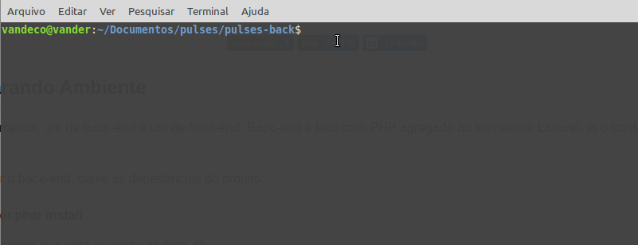
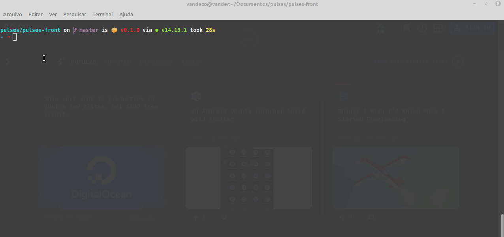

<h1 align="center"> Pulses Teste </h1>

<h2>🛠 Preparando Ambiente </h2>

Temos dois projetos, um de back-end e um de front-end. 
Back-end é feito com PHP agregado ao framework Laravel, já o front-end é feito com VueJS.

🔹Após clonar o back-end, baixe as depedências do projeto:

~~~html
php composer.phar install
~~~

🔹Importe os scripts que está na pasta <b>scripts-db</b>;

🔹Feito isso configure o arquivo .env com as credenciais do banco de dado; 

🔹Starte a back-end com o comando:

~~~html
php artisan serve
~~~ 

 Desde então temos nosso back-end startado, agora precisamos startar nosso front-end 

🔹Clone o front-end;

🔹Baixa as depedências do projeto: 

~~~html
npm install
~~~

🔹Starte o front-end com o comando:
  
~~~html
npm run server
~~~

